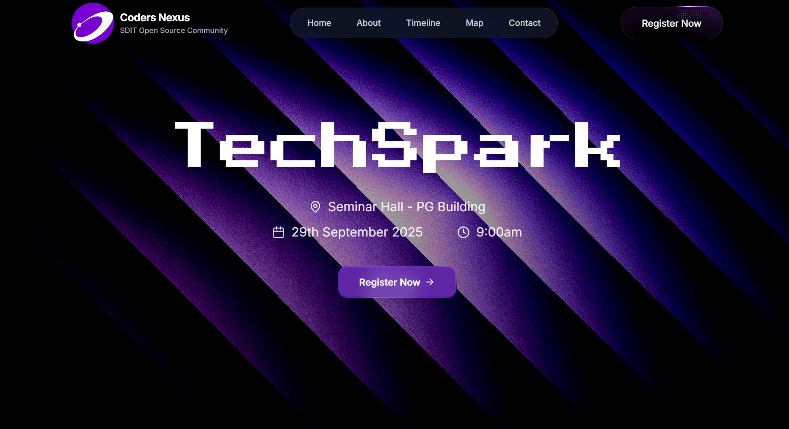

# Techspark - Technical Event Registration Platform

<div align="center">
  
</div>

<h1 align="center">
   Seamless Event Registration for the Tech Community
</h1>

<p align="center">
  <strong>A modern, full-stack web application for seamless technical event registration and comprehensive management tools for administrators.</strong>
</p>

<div align="center">

[](https://nextjs.org)
[](https://react.dev)
[](https://typescriptlang.org)
[](https://tailwindcss.com)
[](https://supabase.com)
[](https://framer.com/motion)
[](https://vercel.com)

</div>

## ✨ Features

### 🎯 User Experience
- **Responsive Landing Page**: Hero section, about, timeline, and interactive map
- **Smooth Registration Flow**: Form validation and real-time feedback
- **Success Confirmation**: Thank-you page and registration confirmation
- **Mobile-First Design**: Optimized for all device sizes
- **Dark Theme Design**: Modern gradient effects with interactive animations

### 🛡️ Admin Management
- **Secure Admin Dashboard**: JWT authentication with HTTP-only cookies
- **Real-Time Participant Tracking**: Live updates with real-time subscriptions
- **Data Export Features**: Excel and PDF export capabilities
- **Participant Search & Filtering**: Advanced search functionality
- **Registration Analytics**: Comprehensive reporting and statistics

### 🎨 Modern UI/UX
- **Interactive Animations**: Framer Motion and GSAP integration
- **3D Elements**: Three.js integration for enhanced visuals
- **Particle Effects**: Enhanced visual appeal with custom effects
- **Custom Components**: Tailwind CSS with custom design system
- **Responsive Design**: Mobile-first approach with smooth transitions

### 🔒 Security Features
- **JWT Authentication**: Secure token-based admin authentication
- **HTTP-Only Cookies**: Protection against XSS attacks
- **Environment Variables**: No hardcoded secrets in source code
- **Row Level Security**: Database-level access control
- **API Route Protection**: All admin endpoints require authentication
- **Session Management**: Automatic token expiration and cleanup

### 🚨 Security Notice
**IMPORTANT**: This is an open-source project. Before deployment:
1. **Change all default credentials**
2. **Generate new JWT secrets**
3. **Set environment variables properly**
4. **Review the [SECURITY.md](SECURITY.md) guide**

## 🛠️ Tech Stack

### Frontend
- **Next.js 15**: React framework with App Router
- **React 19**: Latest React version with modern features
- **TypeScript 5**: Type-safe development
- **Tailwind CSS 4**: Utility-first CSS framework

### Backend & Database
- **Supabase**: Backend-as-a-Service with PostgreSQL
- **Real-time subscriptions**: Live data updates
- **Authentication**: Secure session management

### Animations & UI
- **Framer Motion**: Production-ready motion library
- **GSAP**: Professional animation library
- **Three.js**: 3D graphics library
- **React Three Fiber**: React renderer for Three.js
- **Lucide React**: Beautiful icon library

### Form Handling & Validation
- **React Hook Form**: Performant forms with easy validation
- **Yup**: Schema validation
- **React Hot Toast**: Notification system

### Data Export
- **XLSX**: Excel file generation
- **jsPDF**: PDF generation
- **React to Print**: Print functionality

## 🚀 Getting Started

### Prerequisites
- Node.js 18 or higher
- npm or yarn package manager
- Supabase account for database and authentication

### Installation

1. **Clone the repository**
   ```bash
   git clone https://github.com/shondsouza/Techspark.git
   cd Techspark
   ```

2. **Install dependencies**
   ```bash
   npm install
   # or
   yarn install
   ```

3. **Environment Configuration**
   ```bash
   cp .env.example .env.local
   ```
   
   Fill in your configuration:
   ```env
   NEXT_PUBLIC_SUPABASE_URL=your_supabase_project_url
   NEXT_PUBLIC_SUPABASE_ANON_KEY=your_supabase_anon_key
   SUPABASE_SERVICE_ROLE_KEY=your_service_role_key
   ADMIN_EMAIL=your_admin_email@domain.com
   ADMIN_PASSWORD=your_secure_password
   JWT_SECRET=your_jwt_secret_key
   ```

4. **Database Setup**
   Create the required database function in your Supabase SQL Editor:
   ```sql
   CREATE OR REPLACE FUNCTION get_participant_stats()
   RETURNS JSON
   LANGUAGE plpgsql
   SECURITY DEFINER
   AS $$
   DECLARE
     result JSON;
   BEGIN
     SELECT json_build_object(
       'total_participants', (SELECT COUNT(*) FROM participants),
       'unique_colleges', (SELECT COUNT(DISTINCT college) FROM participants),
       'unique_departments', (SELECT COUNT(DISTINCT department) FROM participants),
       'today_registrations', (
         SELECT COUNT(*) FROM participants 
         WHERE DATE(created_at) = CURRENT_DATE
       ),
       'week_registrations', (
         SELECT COUNT(*) FROM participants 
         WHERE created_at >= CURRENT_DATE - INTERVAL '7 days'
       )
     ) INTO result;
     
     RETURN result;
   END;
   $$;
   
   GRANT EXECUTE ON FUNCTION get_participant_stats() TO service_role;
   ```

5. **Start the application**
   ```bash
   npm run dev
   ```

6. **Access the platform**
   - Main Application: http://localhost:3000
   - Admin Dashboard: http://localhost:3000/admin/login

## 🌐 Deployment

### Deploy to Vercel (Recommended)

1. **Push to GitHub**
   ```bash
   git add .
   git commit -m "Initial commit"
   git push origin main
   ```

2. **Deploy to Vercel**
   - Go to [vercel.com](https://vercel.com) and sign in with GitHub
   - Click "New Project" and import your repository
   - Configure environment variables in Vercel dashboard
   - Deploy!

3. **Environment Variables for Production**
   Add these in Vercel dashboard under Settings > Environment Variables:
   ```
   NEXT_PUBLIC_SUPABASE_URL=your_supabase_url
   NEXT_PUBLIC_SUPABASE_ANON_KEY=your_supabase_anon_key
   SUPABASE_SERVICE_ROLE_KEY=your_service_role_key
   ADMIN_EMAIL=your_admin_email
   ADMIN_PASSWORD=your_secure_password
   JWT_SECRET=your_jwt_secret
   ```

### Alternative Deployment Options
- **Netlify**: Great for static sites with serverless functions
- **Railway**: Full-stack apps with database support
- **Render**: Free tier available with easy deployment

## 🎯 Core Functionalities

### For Event Participants
- View event information and timeline
- Register for technical events
- Receive registration confirmation
- Access event resources and updates

### For Event Administrators
- Manage participant registrations
- Export registration data (Excel/PDF)
- View real-time analytics and statistics
- Search and filter participant data
- Monitor registration trends

### For Event Organizers
- Secure admin dashboard access
- Comprehensive participant management
- Real-time registration monitoring
- Data-driven insights and reporting

## 🔐 Admin Access

- **URL**: `/admin/login`
- **Default Credentials** (Change in production!):
  - Email: `admin@techspark.com`
  - Password: `Admin123SecurePass`

## 📊 Database Schema

### Participants Table
```sql
CREATE TABLE participants (
  id UUID DEFAULT gen_random_uuid() PRIMARY KEY,
  first_name VARCHAR(50) NOT NULL,
  last_name VARCHAR(50) NOT NULL,
  email VARCHAR(255) UNIQUE NOT NULL,
  phone VARCHAR(15) NOT NULL,
  college VARCHAR(255) NOT NULL,
  year INTEGER NOT NULL,
  department VARCHAR(100) NOT NULL,
  usn VARCHAR(20) UNIQUE NOT NULL,
  created_at TIMESTAMP WITH TIME ZONE DEFAULT NOW()
);
```

## 📝 License

This project is licensed under the MIT License - see the [LICENSE](LICENSE) file for details.

## 👥 Contributing

We welcome contributions! Please read our [contributing guidelines](CONTRIBUTING.md) and [security policy](SECURITY.md) before getting started.

## 📞 Support

For support and questions:
- 📧 Email: codersnexus.osc@gmail.com
- 🌐 GitHub: [Coders Nexus SDIT](https://github.com/codersnexus-sdit)
- 💬 LinkedIn: [Coders Nexus](https://linkedin.com/company/codersnexus-sdit)

---

<div align="center">
  <p><strong>Made with ❤️ for the tech community</strong></p>
  <p>Techspark - Where innovation meets registration</p>
</div>